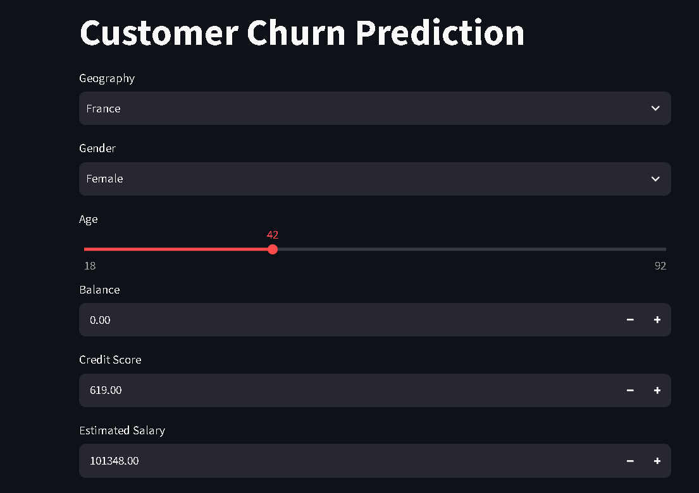
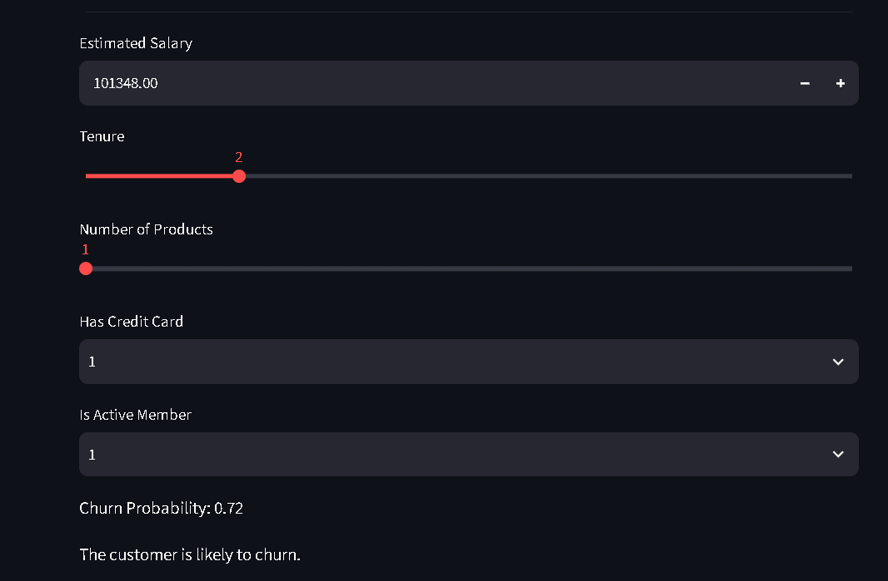

# Customer Churn Prediction — ANN Classification

A Streamlit web app that predicts whether a bank customer is likely to churn, powered by an Artificial Neural Network (ANN) trained on the classic Bank Customer Churn dataset.

**Live demo:** https://customer-churn-prediction---ann-classification-lzijzws58ujv4ac.streamlit.app/

---

## Table of Contents

- [Overview](#overview)
- [Demo](#demo)
- [Dataset](#dataset)
- [Model](#model)
- [Project Structure](#project-structure)
- [Tech Stack](#tech-stack)
- [Getting Started](#getting-started)
- [How It Works](#how-it-works)
- [Results](#results)
- [Limitations](#limitations)
- [Future Work](#future-work)
- [License](#license)

---

## Overview

Banks lose significant revenue when customers close their accounts (churn). This project builds a binary classifier — an Artificial Neural Network built with TensorFlow/Keras — that estimates the probability a given customer will churn, based on their profile (credit score, geography, age, balance, product usage, and activity level).

The trained model is wrapped in an interactive **Streamlit** app so anyone can enter a customer's details and get an instant churn probability, without touching any code.

## Demo



To try it locally, see [Getting Started](#getting-started).

## Dataset

The model is trained on [`Churn_Modelling.csv`](./Churn_Modelling.csv), a standard bank customer churn dataset of 10,000 records with the following fields:

| Column | Description |
|---|---|
| `CreditScore` | Customer's credit score |
| `Geography` | Country (France, Germany, Spain) |
| `Gender` | Male / Female |
| `Age` | Customer's age |
| `Tenure` | Years the customer has been with the bank |
| `Balance` | Account balance |
| `NumOfProducts` | Number of bank products the customer uses |
| `HasCrCard` | Whether the customer has a credit card (0/1) |
| `IsActiveMember` | Whether the customer is an active member (0/1) |
| `EstimatedSalary` | Customer's estimated salary |
| `Exited` | Target — 1 if the customer churned, 0 otherwise |

`RowNumber`, `CustomerId`, and `Surname` are dropped during preprocessing since they carry no predictive signal.

## Model

- **Type:** Feedforward Artificial Neural Network (ANN), built with `tensorflow.keras`
- **Task:** Binary classification (churn vs. retained)
- **Preprocessing:**
  - `Gender` → label-encoded (`label_encoder_gender.pkl`)
  - `Geography` → one-hot encoded (`onehot_encoder_geo.pkl`)
  - All features → standardized with `StandardScaler` (`scalar.pkl`)
- **Training/evaluation:** see [`experiments.ipynb`](./experiments.ipynb) for exploratory data analysis, preprocessing, model architecture, and training curves (TensorBoard logs)
- **Inference walkthrough:** see [`prediction.ipynb`](./prediction.ipynb) for a step-by-step example of loading the saved artifacts and scoring a single customer
- **Saved artifacts:**
  - `model.h5` — trained Keras model
  - `label_encoder_gender.pkl`, `onehot_encoder_geo.pkl`, `scalar.pkl` — fitted preprocessing objects, required at inference time to transform new input the same way the training data was transformed

### Architecture

A fully-connected feedforward network with two hidden layers, taking the 11 preprocessed input features (credit score, age, tenure, balance, number of products, has-credit-card, is-active-member, estimated salary, gender, and one-hot encoded geography) down to a single sigmoid output:

| Layer | Type | Output Shape | Params |
|---|---|---|---|
| dense_12 | Dense (ReLU) | (None, 64) | 832 |
| dense_13 | Dense (ReLU) | (None, 32) | 2,080 |
| dense_14 | Dense (ReLU) | (None, 16) | 528 |
| dense_15 | Dense (sigmoid) | (None, 1) | 17 |

**Total params: 3,457 (13.50 KB)** — all trainable, 0 non-trainable.

- **Optimizer:** Adam
- **Loss:** Binary cross-entropy
- **Callbacks:** Early stopping on validation loss (training was configured for up to 500 epochs but stopped at epoch 19 once validation loss stopped improving), plus TensorBoard logging for the training curves

### Training

The model was trained with an 80/20 train-validation split. Training accuracy climbed steadily while validation accuracy plateaued and validation loss began to creep back up after roughly epoch 9 — the signature of early stopping kicking in before the model started overfitting:

| Epoch | Train Accuracy | Train Loss | Val Accuracy | Val Loss |
|---|---|---|---|---|
| 1 | 0.8298 | 0.4070 | 0.8580 | 0.3602 |
| 5 | 0.8614 | 0.3444 | 0.8575 | 0.3465 |
| 9 | 0.8621 | 0.3314 | 0.8605 | **0.3434 (best)** |
| 15 | 0.8676 | 0.3217 | **0.8660 (best)** | 0.3505 |
| 19 (final) | 0.8715 | 0.3113 | 0.8510 | 0.3573 |

Best validation accuracy reached **86.6%**, with the lowest validation loss (0.3434) at epoch 9. Full per-epoch logs are available in TensorBoard via `experiments.ipynb`.

> **Still to add:** the epoch table above comes from training logs only. For a complete model card, also report held-out **test-set** metrics — precision, recall, F1, and ROC-AUC — since this is a churn dataset with class imbalance (~20% churned) and accuracy alone can be misleading. See the [Results](#results) section below for the exact code to generate these.

## Project Structure

```
Customer-Churn-Prediction---ANN-Classification/
├── app.py                      # Streamlit app — loads model + encoders, serves predictions
├── experiments.ipynb           # EDA, preprocessing, model training, evaluation
├── prediction.ipynb            # Single-record inference walkthrough
├── Churn_Modelling.csv         # Training dataset (10,000 bank customers)
├── model.h5                    # Trained ANN (Keras)
├── label_encoder_gender.pkl    # Fitted LabelEncoder for Gender
├── onehot_encoder_geo.pkl      # Fitted OneHotEncoder for Geography
├── scalar.pkl                  # Fitted StandardScaler
├── requirements.txt            # Python dependencies
└── .gitignore
```

## Tech Stack

- **Modeling:** TensorFlow / Keras, scikit-learn
- **Data handling:** pandas, NumPy
- **Visualization / experiment tracking:** Matplotlib, TensorBoard
- **App/UI:** Streamlit

## Getting Started

### Prerequisites

- Python 3.9+
- pip

### Installation

```bash
git clone https://github.com/Rajamikrani/Customer-Churn-Prediction---ANN-Classification.git
cd Customer-Churn-Prediction---ANN-Classification
pip install -r requirements.txt
```

### Run the app

```bash
streamlit run app.py
```

Then open the local URL Streamlit prints (typically `http://localhost:8501`) in your browser.

### Retrain the model (optional)

Open [`experiments.ipynb`](./experiments.ipynb) in Jupyter to rerun preprocessing, retrain the ANN, and regenerate `model.h5` and the `.pkl` encoders/scaler.

## How It Works

1. The user enters customer details (credit score, geography, gender, age, tenure, balance, number of products, credit card status, active-member status, estimated salary) through the Streamlit form.
2. `Gender` is label-encoded and `Geography` is one-hot encoded using the same encoders fitted during training.
3. The full feature vector is scaled with the saved `StandardScaler`.
4. The scaled vector is passed to the trained ANN, which outputs a churn probability between 0 and 1.
5. The app displays the probability and a plain-language verdict (likely to churn / not likely to churn).

## Results

**From training:**

| Metric | Value |
|---|---|
| Best validation accuracy | 86.6% (epoch 15) |
| Best validation loss | 0.3434 (epoch 9) |
| Final training accuracy | 87.15% (epoch 19) |

**Still needed — held-out test set metrics:**

The numbers above come from the validation split monitored during training, not a final held-out test set evaluated after training finished. To complete the model card, run this after loading the saved model:

```python
from sklearn.metrics import (
    accuracy_score, precision_score, recall_score,
    f1_score, roc_auc_score, confusion_matrix, classification_report
)

y_pred_prob = model.predict(X_test)
y_pred = (y_pred_prob >= 0.5).astype(int)

print(f"Accuracy:  {accuracy_score(y_test, y_pred):.4f}")
print(f"Precision: {precision_score(y_test, y_pred):.4f}")
print(f"Recall:    {recall_score(y_test, y_pred):.4f}")
print(f"F1 Score:  {f1_score(y_test, y_pred):.4f}")
print(f"ROC-AUC:   {roc_auc_score(y_test, y_pred_prob):.4f}")
print(confusion_matrix(y_test, y_pred))
```

This matters specifically for this dataset: `Exited` is imbalanced (~20% churned), so accuracy alone is a weak signal — precision, recall, and ROC-AUC tell a more honest story of how well the model actually catches churners versus just predicting "stays" most of the time.

## Limitations

- Trained on a single synthetic-style dataset (`Churn_Modelling.csv`); performance on real-world banking data may differ.
- No SHAP/feature-importance explainability layer yet — predictions are not currently accompanied by "why" the model flagged a customer.
- Model artifacts (`.pkl`/`.h5`) are committed directly to the repo rather than tracked with a model registry — fine for a portfolio project, but worth flagging as a simplification.

## Future Work

- Add SHAP-based explainability to show which features drove each prediction.
- Add a model card with full training config, dataset card, and fairness/bias checks across `Geography` and `Gender`.
- Containerize with Docker and add a CI workflow (lint + test + retrain check).
- Deploy publicly (Streamlit Community Cloud / Render) and link the live demo above.

## License

Add a license (e.g. MIT) if you intend this repo to be reused by others.